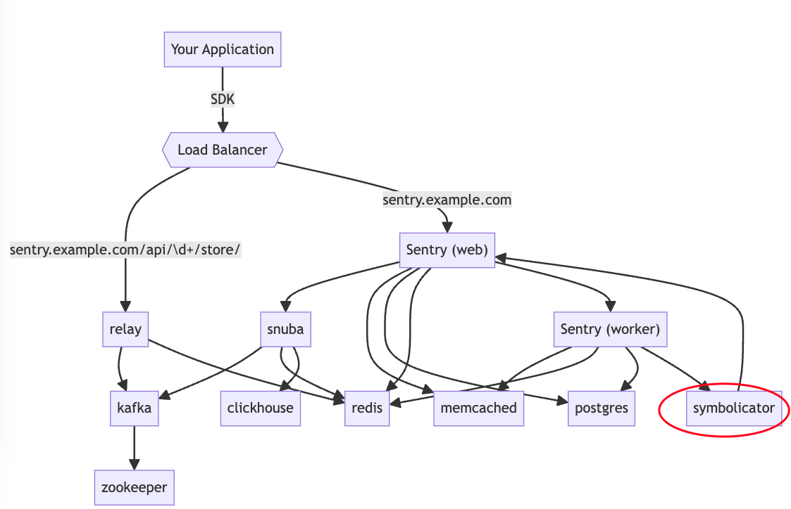
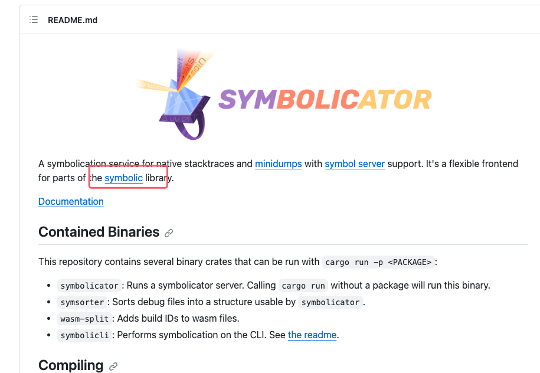
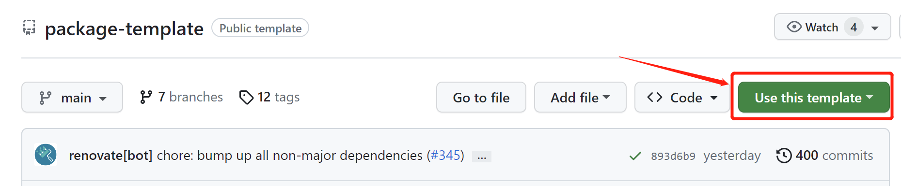
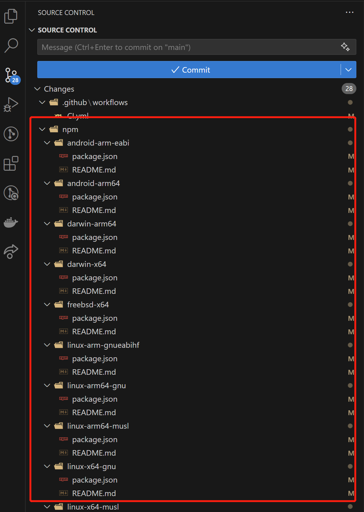
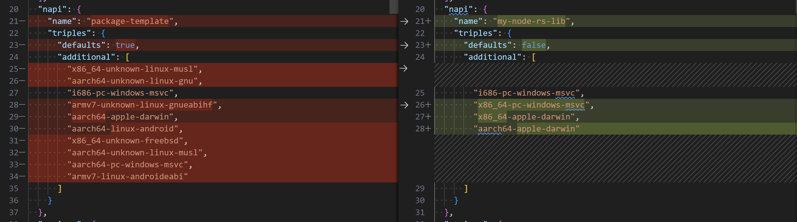
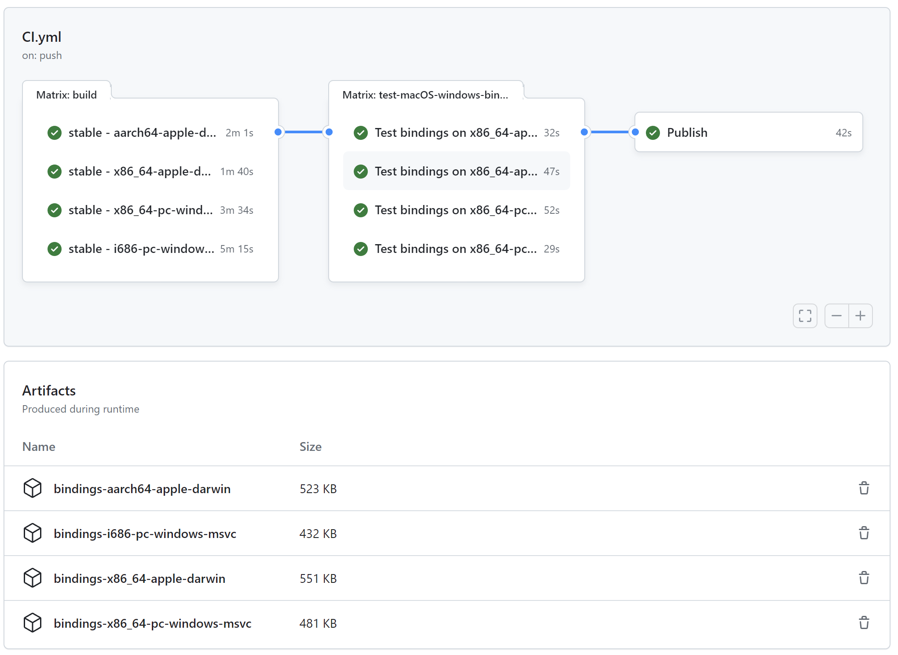

> 是🦀，我加了🦀

## 崩溃文件的问题，它也是问题...

对于一个 electron 应用来说，使用框架自带的 `crashReporter` API 捕获应用进程的崩溃实在是太容易不过了：

```ts
import { crashReporter } from 'electron';

crashReporter.start();
```

设置后，应用会启动一个独立的监听进程，在应用的其他进程发生崩溃时，该监听进程会捕获到这些进程的崩溃信息，并将后缀名为 `.dmp` 的转储文件（实际上是 minidump 文件）写入到特定的崩溃目录中。如果应用同时也接入了一些崩溃采集服务（例如 Sentry），这些崩溃文件也会被上传到服务器进行解析、符号表映射、分类归档，供开发者分析、排查。（...and more in real user case）

(图片：描述崩溃采集->本地文件->服务端记录)
（https://chromium.googlesource.com/crashpad/crashpad/+/refs/heads/main/doc/overview_design.md）

由于 electron 应用的多进程特性，崩溃目录中的文件，既可能是来自于框架的**辅助进程**例如 Network Service、GPU Service（框架会自动重新拉起辅助进程），也可能来自于某个功能的 **node.js 子进程**（业务实现上会做异常处理），而不是用户可感知应用存活所依赖的**主进程**或**窗口进程**——这给我们采集上报、计算应用的真实崩溃率造成了很大的困扰：如何准确的获取这些崩溃文件对应的进程类别？

在接入了较新版本的 Sentry 服务后，我们发现 Sentry 上的崩溃记录详情中，新增了发生崩溃的进程和系统的相关信息：


这带给我们以启发：既然 Sentry 能解出这些崩溃文件中的进程信息，那我们是否可以在客户端侧也进行崩溃文件解析，从而在端侧准确的获得客户端的真实崩溃情况，做一些针对性的判断、帮助提示或优化？

## 客户端侧解析崩溃，能不能行？

electron 中的 `crash-reporter` 实际上使用的是 chromium 开源工程中的 [crashpad](https://chromium.googlesource.com/crashpad/crashpad/+/refs/heads/main/README.md) 项目。根据其文档，我们可以编译出对应平台的可执行的解析程序。但我们更希望的是一种可供编程式调用的接口，这点官方并未提供。好在 Sentry 也是完全开源的，不妨从它入手，看看它是怎么做的：



上图是 Sentry 的[服务部署架构图](https://develop.sentry.dev/architecture/)。显然，图中的 `Symbolicator` 即是负责处理崩溃文件的服务节点。



该服务使用了 [symbolic](https://github.com/getsentry/symbolic) 作为解析工具，而 `symbolic` 是 Sentry 团队开发的一个集中解析各种常见应用崩溃文件的 rust 库，它调用 [rust-minidump](https://github.com/rust-minidump/rust-minidump) 解析 electron 等应用产出的 minidump 文件。

我们目前的诉求仅限于解析出 minidump 文件携带的进程信息，并不包括还原调用堆栈及符号表映射，使用它已完全足够。对照文档，试着编写 rust 代码，验证是否可行（此处省略 5000 字仓促学习 rust 语法过程）：

```rust
use minidump::*;

fn main() -> Result<(), Error> {
    // 读取 minidump 文件
    let dump = minidump::Minidump::read_path("./fixtures/mac-main.dmp")?;

    // 获取其中的几类我们关心的特定数据流
    let system_info = dump.get_stream::<MinidumpSystemInfo>()?;
    let exception = dump.get_stream::<MinidumpException>()?;
    let crashpad_info = dump.get_stream::<MinidumpCrashpadInfo>()?;

    // 打印出崩溃原因及系统信息
    let crash_reason = exception.get_crash_reason(system_info.os, system_info.cpu);
    println!("crash reason: {}", crash_reason);
    println!("system_info: os = {}, cpu = {}", system_info.os, system_info.cpu);

    // 打印出 crashpadInfo 的全部内容
    println!("crashpad_info module_list size: {}", crashpad_info.module_list.len());
    for m in crashpad_info.module_list.iter() {
        println!("crashpad_info module_list: module_list_index = {}", m.module_index);
        println!("crashpad_info module_list: list_annotations = {:?}", m.list_annotations);

        println!("crashpad_info simple_annotation size: {}", m.simple_annotations.len());
        for (k, v) in &m.simple_annotations {
            println!("simple_annotation: k = {}, v = {}", k, v);
        }

        println!("crashpad_info annotation_objects size: {}", m.annotation_objects.len());
        for (k, v) in &m.annotation_objects {
            match v {
                MinidumpAnnotation::Invalid => println!("annotation_objects: k = {k}, v = <invalid>"),
                MinidumpAnnotation::String(string) => println!("annotation_objects: k = {k}, v = {string}"),
                MinidumpAnnotation::UserDefined(_) => println!("annotation_objects: k = {k}, v = <user defined>"),
                MinidumpAnnotation::Unsupported(_) => println!("annotation_objects: k = {k}, v = <unsupported>"),
                _ => print!("<unknown>"),
            }
        }
    }
    Ok(())
}
```

以下是运行结果：

```bash
$ cargo run
   Compiling rust-parse-minidump v0.1.0 (/Volumes/workspace/workspace/playground/rust-parse-minidump)
    Finished dev [unoptimized + debuginfo] target(s) in 0.62s
     Running `target/debug/rust-parse-minidump`
crash reason: EXC_BAD_ACCESS / KERN_INVALID_ADDRESS
system_info: os = mac, cpu = amd64
crashpad_info module_list size: 1
crashpad_info module_list: module_list_index = 1
crashpad_info module_list: list_annotations = []
crashpad_info simple_annotation size: 0
crashpad_info annotation_objects size: 8
annotation_objects: k = io_scheduler_async_stack, v = 0x1190B041D 0x0
annotation_objects: k = osarch, v = x86_64
annotation_objects: k = pid, v = 79481
annotation_objects: k = platform, v = darwin
annotation_objects: k = process_type, v = browser
annotation_objects: k = ptype, v = browser
annotation_objects: k = total-discardable-memory-allocated, v = 12582912
annotation_objects: k = ui_scheduler_async_stack, v = 0x1192B063A 0x1190B041D
```

Bingo! 程序成功打印出了传入的崩溃文件的真实进程类型，可行性得到了验证。接下来我们需要编写在 electron 应用——其实是 node.js 环境——中调用 rust 的拓展程序。我们熟悉的 rust 版的 babel——[swc](https://github.com/swc-project/swc) 早已在前端生态圈里掀起了一阵 node.js 调用 rust 程序的风潮。既有珠玉在前，想必是问题不大了。

## 编写 node.js rust 拓展程序

写过 node.js C++ 拓展的小伙伴可能会知道，node.js 官方在 v8.0 版本后推出了 ABI-Stable 的 [napi](https://nodejs.org/api/n-api.html) 框架，保障其在所有的后续 node.js 版本中兼容。自此之后，社区活跃的源生模块纷纷迁往 `napi` 实现，彻底终结了以前 node.js 版本变化就不得不本机环境重编源生依赖的时代，也让**预编译的二进制文件**(prebuilt binary)成了 node 源生模块交付的主流选择。但在调用 rust 代码方面，并没有这样的一套由 node.js 官方维护或推荐的框架。目前，rust 社区主要有以下三种 node.js rust 拓展框架，分别是：

- [neon-binding](https://github.com/neon-bindings/neon): 可能是 rust 社区最早的 node.js rust 拓展框架。`swc` 早期的版本曾使用过它。不过似乎文档和教程都比较简单，上手实际运用门槛稍有点高；
- [napi-rs](https://github.com/napi-rs/napi-rs): 目前看起来活跃度最高、成熟案例最多的框架，提供了详实的文档和工程完备的脚手架。`swc` 也在三年前迁移到了 `napi-rs`([ref](https://github.com/swc-project/swc/issues/852))；
- [node-bindgen](https://github.com/infinyon/node-bindgen): 目前看起来还比较小众，没有找到什么出名的案例。

经过对比，我们决定选用 `napi-rs` 实现功能。`napi-rs` 已提供了一套完善度极高的脚手架工程模版 [napi-rs/package-template](https://github.com/napi-rs/package-template)，接下来我们利用它实现目标功能。

### 工程搭建

`napi-rs` 已提供了一套完善度极高的脚手架工程 [napi-rs/package-template](https://github.com/napi-rs/package-template)，可以直接从该模板仓库上 clone 到本地：

```bash
$ git clone git@github.com:napi-rs/package-template.git
```

或者使用 github 页面上提供的 "Use this template" 功能直接创建自己的远端仓库均可：



> ⚠ 由于该模板工程使用的 swc 版本以及流水线配置里的运行环境的限制，以下开发过程均要求使用 node.js v18+ 以及 yarn v4+，如果你是 yarn classical 的遗老遗少，请先按需使用 nvm 配置好运行环境 :)

接下来安装依赖，并且将模板工程中的模板项目名称换成自己的项目名：

```bash
$ yarn install
$ npx napi rename -n my-node-rs-lib
```

`napi` 是模板内提供的脚手架工程的辅助 CLI 工具，负责实施将 rust 编译产物最终发布为 npm 包的一些工程化上的琐碎事项，例如读取约定的配置、构建产物移动到特定位置、修改版本号、批量发布等等。此处我们先手动使用它来重命名工程，避免发包时产生包名冲突。操作后，git 提示 `<project>/npm/` 目录中许多子目录文件出现了变更：



这些目录的作用是什么？通过其名称，很容易猜到它们应该是当前工程编译到各个平台的**预编译二进制文件**的发布目录。没错！该工程预配置了几乎所有主流平台架构的编译、发布能力。但目前，鉴于我们只想在 Windows/MacOS 的 electron 应用中使用，实在是不需要这么大而全的配置，可以直接做一些删减。在 `<project>/package.json` 中，修改 `napi` 配置项的值：



在此，我们仅保留了 Windows x64/Windows ia32/MacOS Arm64/MacOS x64 这四种平台架构作为构建目标。需要特别注意的是 `defaults` 要调整为 `false` 以阻止其默认的平台产物构建，否则稍后发布过程中可能会有耗费你一小时 DEBUG 的神秘事件发生。相应的，`<project>/npm/` 目录下那些不需要的目标目录也都可以直接删除了。

> ⚠ 完整的可支持的编译目标列表，可使用命令 `rustup target list` 查看，或参看文档 [rust platform support](https://doc.rust-lang.org/nightly/rustc/platform-support.html)。

### 编码 & 验证

接下来开始编码实现。我们的目标是在 node.js 中调用 rust 拓展中暴露的 `getCrashpadInfo` 方法，传入文件路径，获取前文样例代码中的 `minidump::MinidumpCrashpadInfo` 数据结构，并交付给 node.js 上下文。这个流程大致可以拆解为：

1. 注册供 node.js 调用的函数；
2. 将从 node.js 侧得到的函数参数，转换为 rust 的数据类型，例如将 `JsNumber` 转换为 `i32`；
3. 使用 rust 完成业务逻辑，产出一份 rust 的结果数据结构，例如某个 `i32`；
4. 将上述结果数据结构，转换为 node.js 的数据类型，例如将 `i32` 转化为 `JsNumber`；
5. 结果返回给 node.js 的函数调用栈。

利用 `napi-rs` 提供的 `#[napi]` 属性，我们几乎完全不需要关心 #1, #3, #4, #5 步骤如何实现，基本可以专注于使用 rust 编写业务功能。以下是大致实现：

```rust
use napi_derive::napi;

/// Additional Crashpad-specific information about a module carried within a minidump file.
#[napi(object)]
pub struct MinidumpModuleCrashpadInfo {
  /// Index of the corresponding module in the `MinidumpModuleList`.
  pub module_index: u32,
  pub list_annotations: Vec<String>,
  pub simple_annotations: HashMap<String, String>,
  pub annotation_objects: HashMap<String, String>,
}

#[napi(object)]
pub struct CrashpadInfo {
  pub module_list: Vec<MinidumpModuleCrashpadInfo>,
}

#[napi]
pub fn get_crashpad_info(path: String) -> napi::Result<CrashpadInfo> {
  let dump_result = minidump::Minidump::read_path(path);

  //...此处省略具体构造 CrashpadInfo 的实现

  Ok(CrashpadInfo {
    //...
  })
}
```

以上代码中，除了几行 `#[napi]` 属性标注，基本上没有与 node.js 数据类型打交道的胶水代码，与正常的 rust 程序别无二致，`napi-rs` 已帮我们实现了 rust 与 node.js 的绝大多数[数据类型自动转换](https://github.com/napi-rs/napi-rs#features-table)。试着编译运行一下，看看效果如何：

```bash
$ yarn build
napi build --platform --release --pipe "prettier -w"
   Compiling my-node-rs-lib v0.1.0 (/Volumes/workspace/workspace/my-node-rs-lib)
    Finished release [optimized] target(s) in 10.44s
Run prettier -w /Volumes/workspace/workspace/my-node-rs-lib/index.js
index.js 116ms
Run prettier -w /Volumes/workspace/workspace/my-node-rs-lib/index.d.ts
index.d.ts 215ms
```

`napi` 很贴心的帮我们生成了完整的 node.js 侧判断当前的平台架构以载入正确 binary 的代码，甚至包含一份精准的类型文件，甚至也把 rust `///` 注释转换成了 jsdoc `/** */` 注释，甚至还把 rust 中以 snake_case 定义的名称全转成了在 TS 中常用的 camelCase，开发体验直接拉满:

```ts
/* tslint:disable */
/* eslint-disable */

/* auto-generated by NAPI-RS */

/** Additional Crashpad-specific information about a module carried within a minidump file. */
export interface MinidumpModuleCrashpadInfo {
  /** Index of the corresponding module in the `MinidumpModuleList`. */
  moduleIndex: number
  listAnnotations: Array<string>
  simpleAnnotations: Record<string, string>
  annotationObjects: Record<string, string>
}
export interface CrashpadInfo {
  moduleList: Array<MinidumpModuleCrashpadInfo>
}
export function getCrashpadInfo(path: string): CrashpadInfo
```

现在已可以像一个普通的 commonJs 模块那样直接在 node.js 中调试、验证该 rust 拓展了。不过，更好的做法是添加单元测试。该脚手架工程中，已准备好了 ava 单测环境。我们在目录中 `<project>/fixtures/` 中，放置了一些预生成的 electron 应用的各类别进程产生的崩溃文件，作为测试目标，再在 `<project>/__test__/index.spec.ts` 中补几个简单的用例：

```ts
import path from 'path'

import test from 'ava'

import { getCrashpadInfo } from '../index'

function resolveDumpFile(name: string) {
  return path.join(__dirname, '../fixtures/', name)
}

test('should throw error if target file not exist', (t) => {
  const file = resolveDumpFile('not-existed-file.dmp')

  const error = t.throws(() => {
    getCrashpadInfo(file)
  })

  t.is(error?.message, 'read minidump file failed')
})

test('should get process type & pid from mac electron main process dump file correctly', (t) => {
  const file = resolveDumpFile('mac-electron-browser.dmp')

  const result = getCrashpadInfo(file)
  t.is(result.moduleList[0].annotationObjects['process_type'], 'browser')
  t.is(result.moduleList[0].annotationObjects['pid'], '11423')
})
```

运行单元测试：

```bash
$ yarn test

  ✔ should throw error if target file not exist
  ✔ should get process type & pid from mac electron main process dump file correctly (21ms)
  ─

  2 tests passed
```

一切顺利！有了单测，在不同平台上验证就更加有保障了。

### 多平台构建发布

`napi-rs/package-template` 已配置好了一套使用 Github Actions 的多平台构建发布的完整的 CI/CD 流程。以前，往往需要用不同的机器环境分别拉取代码本地编译好，再将编译产物添加到仓库中，作为预编译的二进制文件发布；但利用 Github Actions 提供的各种环境矩阵，多平台构建变得轻而易举。以下是一次 CI 过程的任务图：



如图所示，CI 产出的 artifacts 就是我们需要的各平台的预编译的二进制文件产物。之前我们已添加了单测，这些产物都已在各平台通过单测，相当可靠！

如果在仓库中配置好了 [npm token](https://docs.github.com/en/packages/working-with-a-github-packages-registry/working-with-the-npm-registry)，在 CI 流程的发布阶段，这些构建产物会分别移到前文提到的 `<projects>/npm/` 中的对应目录中，作为该模块在各目标平台下的预编译产物，以 npm 包的形式发布出去。如无意外的话，我们可以在 npm 中找到刚刚发布出去的这几个包：

- my-node-rs-lib-win32-x64-msvc@1.0.0
- my-node-rs-lib-darwin-x64@1.0.0
- my-node-rs-lib-win32-ia32-msvc@1.0.0
- my-node-rs-lib-darwin-arm64@1.0.0
- my-node-rs-lib@1.0.0

注意看最后一个包 `my-node-rs-lib`，它才是我们应该直接使用的模块，而其他的各平台的子模块，都是它的 `optionalDependencies`。

## References

- <https://www.electronjs.org/docs/latest/api/crash-reporter>
- <https://chromium.googlesource.com/crashpad/crashpad/+/refs/heads/main/README.md>
- <https://github.com/getsentry/symbolicator>
- <https://lyn.one/2020/09/11/rust-napi>
